 Untiy3D.EmojiText

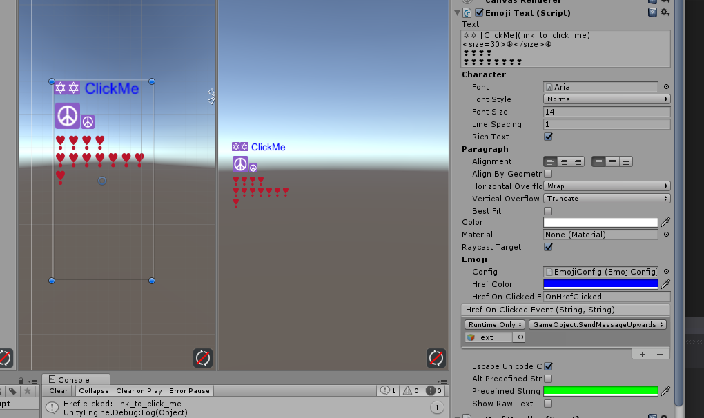

## EmojiText

+ Extends from UnityEngine.UI.Text
+ Has the same performance if no EmojiConfig attached.
+ Layout handled by UnityEngine.UI.Text, only replaces UVs of generated text mesh. Thus you can use RichText to change size and color of text. (Emoji sprite wont change color. I disabled it. And you also need to set sizeFactor in EmojiConfig to 1)
+ No sub GameObject needed (actually need one for attaching CanvasRenderer). Use CanvasRenderer to render emoji mesh.
+ Support hyperlink click event with markdown link syntax. `[ClickMe](link_to_some_place)`
+ Support pre-defined text by markdown predefined text syntax. \`predefined text\`. And predefined text replacements delegates to `EmojiText.willInsertBackOnePredefinedString`.
+ Support escape character by input \uxxxxx directly.
+ Generate your own EmojiConfig with different emojis by using AltasBaker in Emoji -> Atlas Baker (you can use altas baker for other stuff, it reports all UVs and names to AtlasBakerWizard.OnAtlasBaked)
+ Works in edit mode.

## Quick setup
1. Copy Unity3D.EmojiText to your own Assets folder
2. Create GameObject under Canvas
3. Attach EmojiText component to the GameObject just created
4. Drag and drop asset `Unity3D.EmojiText/EmojiConfig` to Config field

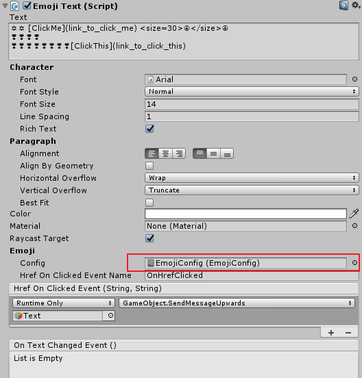

5. Now you have emoji text with all TwitterEmoji characters.
6. If you want to handle hyperlink (markdown syntax), just add some Href On Clicked Event
7. Check `scn_demo` for more details.
8. Unity3D 5.3.x has bugs in InputField with emoji charaters, plz check `EmojiTouchScreenInputField.cs` for details (i just copy from UnityEngine.UI and did some fix).

## Create your own emoji characters
1. Create folder in your project. (like `Assets/MyEmoji`)
2. Copy your emoji sprites to this folder. The name of sprite should be the unicode of character. If you want to replace `A` with emoji sprite, just put a `41.png` to MyEmoji folder

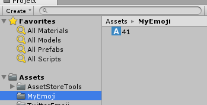

3. Add EmojiText component to a GameObject without assigning EmojiConfig, you can see `Create Config` button in Inspector

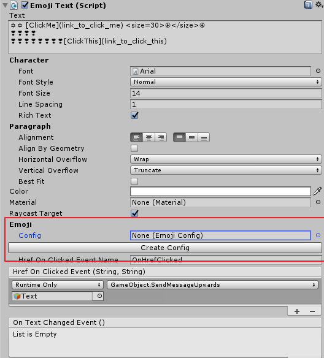

4. Press `Create Config` button, you will get a EmojiConfig.asset in Assets folder

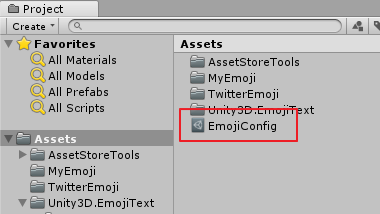

5. Select EmojiConfig.asset. You can see 

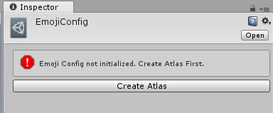

6. Click `Create Atlas` and in the Atlas tool box, put path to `Asset/MyEmoji` in path to texture field, and then press `Atlas` button

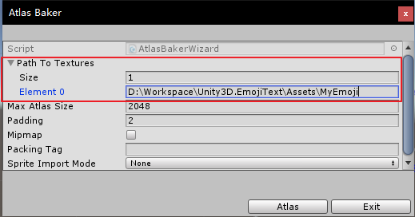

7. Now you will atlas texture and correct emoji config with character `A`

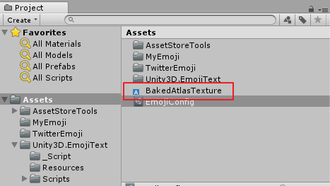
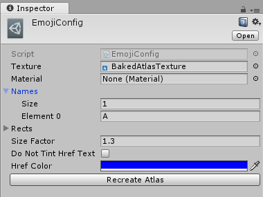
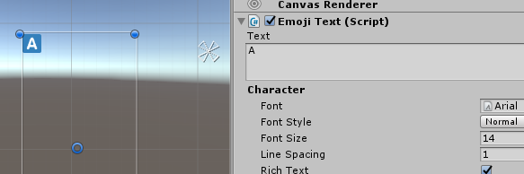

8. If you want to add more emoji character to exist config, you can add multiple paths in atlas step

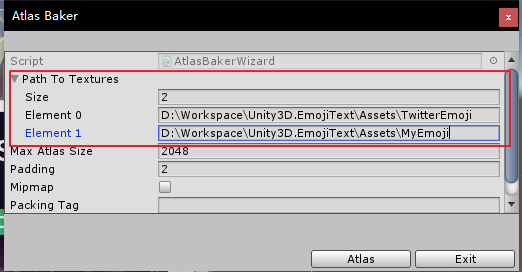

## License

TwitterEmoji comes from [Twemoji project](https://github.com/twitter/twemoji). It licensed under [CC-BY 4.0](https://creativecommons.org/licenses/by/4.0/). And I copied from [Unity-UI-emoji](https://github.com/mcraiha/Unity-UI-emoji). 

Idea and some part of code come from [Unity-UI-emoji](https://github.com/mcraiha/Unity-UI-emoji), I changed it to fit my implementation.

## Misc

steam: 0x600d1dea

